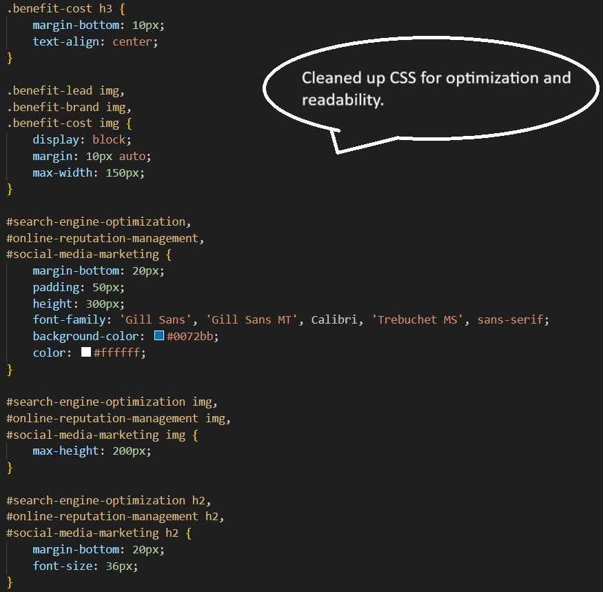
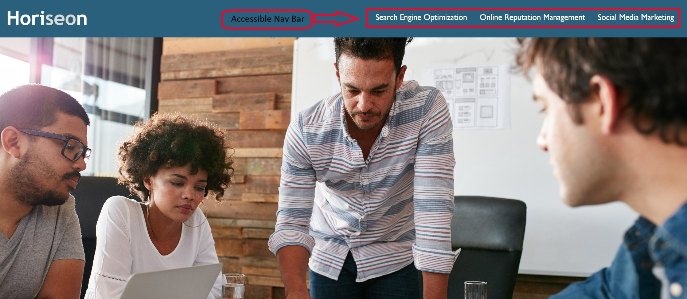

# Horiseon SEO and social media marketing services

## Description
 - My motivation and reasoning for obuilidng this project was to learn how to impliment accessibility standards. These include elements following logical structure, accessible alt attributes, sequential order of heading attributes and more. This is important so I can gain the ability to construct better optimized search engine opportunties.
 - This solves the problem with the codebase essentially not having optimized SEO. Without it, the traffic towards the webpage and the company could be hindered. It also helps the codebase be more organized.
 - I learned how to help the SEO of a webpage and how to organize and optimize it.

## Useage
 - You have an accessible navigation bar to transition you to topics on the page. Also included with scroll behavior so it transitions smoothly.
 - Overall, the page describes the details of the company and what they can provide for the customers.
 - Following image shows the navigation bar that's useable.
  ```md
  
  ```
- Following image shows the organization improvement within the CSS.
  ```md
  
  ```

## Features 
 - Navigation bar with smooth scroll for smooth transition.
